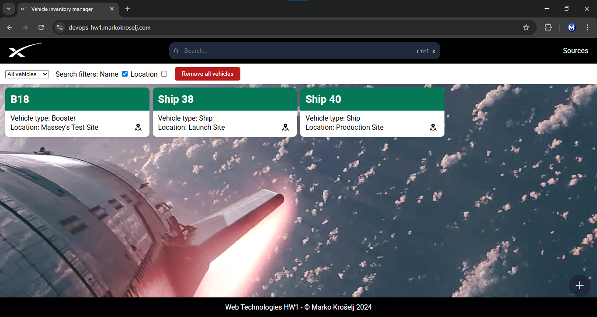
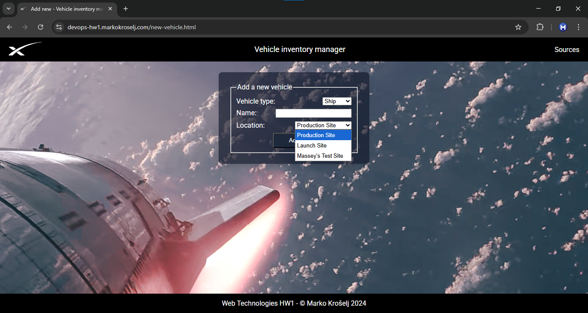

# Automatic web application deployment on virtual machine using [Vagrant](https://developer.hashicorp.com/vagrant) and [Cloud-init](https://cloud-init.io/) + [Multipass](https://canonical.com/multipass) 

For first homework for DevOps class I set up [Vagrant file](https://developer.hashicorp.com/vagrant/docs/vagrantfile) to automatically provision a virtual machine and deploy a simple web application on it. 

## Web application

App is Vehicle inventory manager. It lets you manage information about SpaceX Starship rockets. For each rocket vehicles, you can view name, type and its current location. New vehicle can be added by pressing "+" button. You can enter its name and select type and location. You can select to show both types or just Ship or Booster. You can search vehicle by its name, location or both. Vehicle can be deleted by double clicking on its name or selecting it with the tab and pressing delete key. All vehicles can be deleted at once by clicking Remove all vehicles button.




App consist of 4 components. Frontend, REST API, MySQL database and [Caddy](https://caddyserver.com/) as HTTP server and reverse proxy. Frontend is made using vanilla JavaScript, HTML and CSS. REST API is made in Python web framework [Flask](https://flask.palletsprojects.com/en/stable/). 

### API
API is reversed proxied to /api/. It has three GET end points that return all vehicles ``/get-vehicles``, locations ``/get-locations`` and types ``/get-types`` in JSON format. To get a specific vehicle by its id, use ``/get/vehicle/id``. To add a new vehicle use POST endpoint ``/add-vehicle``. For deleting it has two DELETE end points. For deleting all ``/delete-all-vehicles`` and a specific one by its id ``/delete-vehicle/id``

# Host configuration

Virtual machine with the application was deployed on virtual machine server running Ubuntu 24.04.3. It has 4 core 2.8GHz CPU and 16GB of RAM.

For hypervisor I used VirtualBox. 

On Host machine I installed Git, VirtualBox and Vagrant.
1. Git
    ``sudo apt install git``
2. VirtualBox
3. Vagrant
 [Linux install commands](https://developer.hashicorp.com/vagrant/install#linux)


And then configured firewall
- allowed port 22 for ssh
    
    ``sudo ufw allow 22``
- allowed ports 80 and 443 for http and https

    ``sudo ufw allow 80``

    ``sudo ufw allow 443``
- enabled firewall
    
    ``sudo ufw enable``

  
# Vagrantfile
 
 Initial Vagrantfile was created using ``vagrant init hashicorp-education/ubuntu-24-04 --box-version 0.1.0``

Vagrant box or base image I set to ``hashicorp-education/ubuntu-24-0`` with the box version of 0.1.0.

## Hardware provisioning

Hardware is provisioned to 4GB of RAM and 2 CPUs, using 
```ruby  
config.vm.provider "virtualbox" do |v|
    v.memory = 4096
    v.cpus = 2
  end
```

## Port forwarding 
For web application to be accessible over http and https, ports 80 and 443 need to be forwarded from guest to host.
```ruby
  config.vm.network "forwarded_port", guest: 80, host: 80
  config.vm.network "forwarded_port", guest: 443, host: 443
``` 

## Application provisioning 
Application stack is deployed inside virtual machine using shell script inside Vagrantfile.
``config.vm.provision "shell", inline: $script``

 Environment variables are passed into shell script using #{VARIABLE}. Variables are declared at the top of the file. 

 ### Script
 First it updates the list of packages using ``sudo apt-get update``.
 We are using apt-get instead of apt, because it's better for running inside automated script
 1. Caddy
    
    Caddy is installed using ``sudo apt-get install -y caddy``. 
    y flag is used so installer script doesn't ask us any questions, for which we would have to provide manual keyboard input and just installs it using the defaults. 

    Caddy configuration is defined inside Caddyfile ``/etc/caddy/Caddyfile``. Static server root is set to ``/var/www/app`` and reverse proxy is set to rederect all request starting with /api/ to Flask API. 
    
    Caddy automatically configures HTTPS and SSL certificate. 
2. MySQL server

    MySQL server is installed using ``sudo apt-get install -y mysql-server``. Then it creates database user with its username and password from variables. Creates database with the name from variable. All privileges are granted to user on database. Initial database is imported from dbsetup.sql SQL file. ``-e`` flag in mysql commands are so SQL statment can be executed directly and not in the interactive environment. 

3. Environment variables

    Then are environment variables set up. To allow dynamic environment configuration. Example for DB_HOST: ``echo "export DB_HOST=#{DB_HOST}" >> /home/vagrant/.bashrc``. Other variables  are: DB_USERNAME,DB_PASSWORD,DB_NAME,APP_PORT,DOMAIN. APP_PORT defines the port api is running internaliy. DOMAIN is the domain name app would be accesible from. 

4. API

    Then Python REST API is set up. First pip is installed using ``sudo apt-get  install -y pip``. Because we can't install Python packages directly, Python virtual environment needs to be set up. Using ``sudo apt-get install -y python3.12-venv python3 -m venv /home/vagrant/api/.venv source /home/vagrant/api/.venv/bin/activate``. Required dependencies are specified inside pyproject.toml file and are installed using ``pip install .``. To run API automaticly on startup, systemd service file is created and installed. Because service is running under root user, environment variables need to be again defined inside the service file.

5. Frontend 
    
    Frontend files are copied to server root. `` /var/www/app/``


Virtual machine is started using ``sudo vagrant up``. Sudo is used so privileged ports 80 and 443 work. 

During development I constantly committed and pushed Vagrant file and other changes to GitHub. To get the changes on virtual server I used command ``git fetch origin && git reset --hard origin/main && git clean -fd``. This fetched changes even though Vagrant file was changed on the server. 

# Domain
For app domain I created new subdomain. Inside my domain DNS managed I created new A record and pointed it to the host IP address.

# Usage
Make sure you have Git, Vagrant and VirtualBox installed.
- point domain to the IP of your machine
- clone this repository ``git clone https://github.com/markokroselj/devops-hw1.git``
- cd into it ``cd devops-hw1``
- edit Vagrantfile and add variables. Set DB_NAME to vehicles_db. DB_HOST needs to be localhost. DB_USERNAME and DB_PASSWORD can be anything.
- start virtual machine using ``sudo vagrant up``

## Vagrant usage demo
[YouTube video of app deploy using Vagrantfile](https://www.youtube.com/watch?v=2hj3_0td8bE)


# Cloud-init

# Host configuration
Virtual machine with the application was deployed on regular PC running Windows 10. It has 8 cores and 16GB of RAM.

For Hypervisor, we used Windows Hyper-V.

On host machine, we installed the latest verison of Multipass only. No further configuration was required.

# Cloud-init file
We created cloud-config.yaml file that is passed on as an argument to --cloud-init switch when launching a virtual machine with Multipass.

# Hardware provisioning
Hardware was provisioned by default, to 1 core and ~1GB of RAM.

# Port forwarding
To make the web application accessible from outside the local network, and for Caddy to issue a valid certificate, we launched the virtual machine in bridged network mode and then forwarded ports 80 and 443 directly to the guest. Due to a mix of Caddy certificate and router constraints, the web application was only accessible from outside the local network. 

# Application provisioning
Application stack was deployed inside virtual machine using cloud-config.yaml file, which pre-configures the virtual machine during boot according to our needs.

Environment variables were defined in plain text inside ```/root/secrets.env```, which was then moved to Ubuntu user's home directory and claimed by Ubuntu user. The variables are supposed to be added to the cloud-config.yaml right before launching a virtual machine, therefore reducing the risk of being compromised by someone who gets access to the file. The security could be improved by utilizing a secrets Vault, like for example, Bitwarden Secrets Manager, but this approach might not be much better, since we would still have to pass the access token to the virtual machine/config file right before launch and we also might have to store the secrets in a file regardless, because the secrets are required by many components that make our application.

### Script
The config file first installs the necessary packages.

1. Git
    Git will be used to clone the GitHub repository, which includes files that our application will serve.
2. Caddy
    Like mentioned before, Caddy will serve files from ```/var/www/app``` directory, redirect API calls to Flask API and also configure HTTPS and SSL certificates automatically.
3. MySQL server
    MySQL server will create a user and their password, create a database that will be used by the web application, and grant privileges for this database to the user. Then, the service will run all SQL statements from ```/home/ubuntu/db/dbsetup.sql```, which define the tables and rows in the database.
4. Python, pip, venv
    Python, pip, and the virtual environment are used to set up a self-contained environment for our API. This ensures that the service has all the packages it needs and can start automatically, without requiring manual setup or interfering with other Python projects on the system.

In the ```runcmd```, we first set a static IP to the bridged network interface, due to the port forwarding that we set up on the router earlier. We then clone the GitHub repository and organize the files into their respected directories. We then initialize the Python virtual environment, move the secrets file to Ubuntu user's home directory, wait for MySQL to start up and run the SQL statements. Finally, we configure the ```/etc/caddy/Caddyfile``` to serve files from ```/var/www/app``` and forward API calls to the backend service running locally. Then we simply reload Caddy and start our API service. After these steps, the web application should be online and running.

# Domain
The same subdomain as before was used, but this time pointing to the public IP of the regular PC.

# Usage
Multipass and Hypervisor is required on the host machine.
- point the domain to your public IP
- move into the folder, where cloud-config.yaml file is present
- fill in the missing secret credentials in the file
- run a Command Prompt from inside this folder
- find out the main network interface that the host uses and run ```multipass set local.bridged-network=<name_of_interface>```
- finally, run ```multipass launch --name <name> --cloud-init cloud-config.yam

